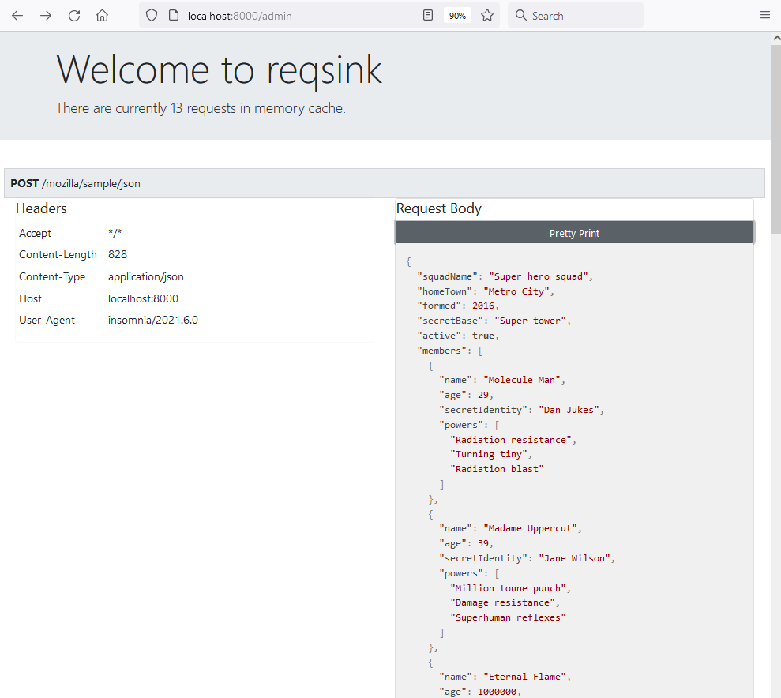

# reqsink

A lightweight HTTP request sink inspired by the original [requestbin](https://github.com/Runscope/requestbin), implemented in Rust as a compact, single-file binary for easy deployment.

## Getting started

It's as simple as:

```bash
$ ./reqsink
Total 1 templates loaded:
"admin.html"
Binding to interface "0.0.0.0:8000"
```

Then send a request:

```bash
curl -X POST -H "Content-Type: application/json" \
  -d '{"hello": "world", "foo": "bar"}' \
  localhost:8000/post/some/json
```

The `/admin` route provides a simple GUI showing the current tracked requests:


## User-defined templates

The default response to any request to is a terse "OK". If you want to customize the response for a given 
route, `reqsink` supports the use of [Tera](https://github.com/Keats/tera) (jinja-style) templates. 

User templates are rendered with access to a `StoredRequest`. See `main.rs` for the struct definition and the fields available in the template. 
eg. for the custom `robots.txt` response in the examples directory, the template is defined as:

```jinja
# Hello, IP {{ request.ip_addr }}. We've been expecting you.

# Group 1
User-agent: Googlebot
Disallow: /nogooglebot/

```

See the `examples` directory for a configuration and template for a user-defined route. 
Any .html file in `templates-dir` or its subfolders will be treated as a template. 

To run with user-defined templates, you can use a command like the following:
```bash
reqsink --user-templates-dir examples --extra-routes ./examples/example-routes.json
```

## Command line options

```
OPTIONS:
    -e, --extra-routes <extra-routes>
            A JSON file mapping the desired route -> template

    -i, --ip-address <ip-address>                    IP-address to bind to [default: 0.0.0.0]
    -p, --port <port>                                Port to bind to [default: 8000]
    -r, --req-limit <req-limit>
            Maximum number of requests to keep in memory [default: 1000]

    -u, --user-templates-dir <user-templates-dir>
            User-defined templates directory. If you want to provide a custom response to a
            particular endpoint, you will need to also provide a JSON file mapping the template to
            the route

```

## Limitations / TODO items

* Persistent storage of requests
* Ability to export requests   
* User-defined templates cannot be used with the same route for more than one method (eg. `/robots.txt` can't have a different `GET` and `POST` response)
* Embed templates and JS content for admin page into binary to remove dependency on jsdelivr CDN